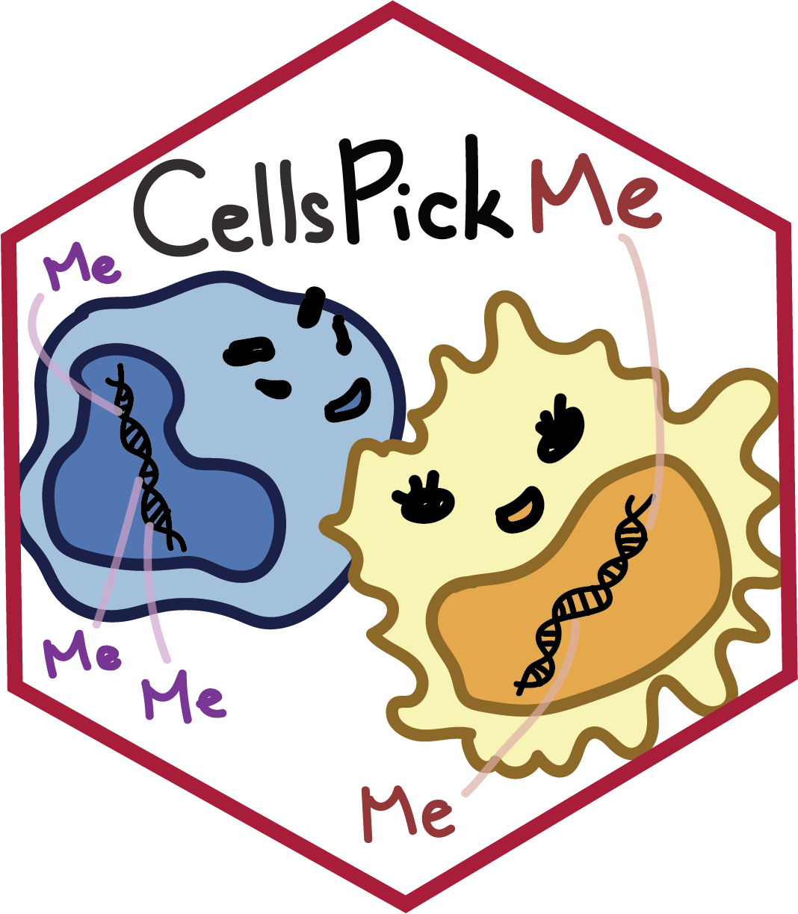

<!-- README.md is generated from README.Rmd. Please edit that file -->

```{r setup, include = FALSE}
knitr::opts_chunk$set(
  collapse = TRUE,
  comment = "#>",
  fig.path = "man/figures/README-",
  out.width = "100%"
)
```

# CellsPickMe

<!-- badges: start -->

[](https://doi.org/10.5281/zenodo.15225880)

<!-- badges: end -->

```{r logo, echo = FALSE, out.height = "25%", out.width = "25%"}

```

The **CellsPickMe** package takes DNA methylation (DNAme) data generated from Illumina microarray of a heterogeneous tissue and predict its cellular composition based on cell types available in the reference profiles. *Notably, for each population of **cells**, the package "**picks**" DNA**me** features that best predict cellular identities with machine learning algorithms to improve deconvolution performance.* Currently, the algorithm is compatible for peripheral blood, cord blood, saliva, and brain (neuron vs non-neuron).

## Installation

You can install the development version of CellsPickMe from [GitHub](https://github.com/) with:

```{r install, message = FALSE, warning = FALSE, eval = FALSE}
# install.packages("devtools")
library(devtools)
devtools::install_github("maggie-fu/CellsPickMe")
```

## Usage

Reference-based cell type deconvolution includes four steps: reference dataset selection, data normalization, feature selection, and cell composition regression.

### 1. Obtain reference dataset

From the available list of reference datasets ("Reinius", "IDOL", "Extended", "UniBlood7", "UniBlood13", "UniBlood19", "Cord", "DLPFC", and "Middleton"), select one that is appropriate for your sample (based on tissue and sample age) For more detail regarding the references, check out the [vignette](https://maggie-fu.github.io/CellsPickMe/articles/CellsPickMe.html) and [UniBlood Reference Generation](https://maggie-fu.github.io/CellsPickMe/articles/UniBlood_references.html) page

```{r getRef, message = FALSE, warning = FALSE}
library(CellsPickMe)

# Request the IDOL reference (2016) with no normalization
ref_dat <- getRef(ref = "UniBlood19", normType = "None")
```

### 2. Normalize sample and reference datasets together

Normalize user's sample and reference data sets together to reduce batch effect and improve prediction accuracy. Option for `normType` includes "Noob", "Funnorm", "Quantile", "Quantile.b", "None", with the first 3 options being exclusively for RGChannelSet objects, and Quantile.b for beta matrix.

```{r combData, message = FALSE, warning = FALSE}
# Load example blood cell mixture, subsetted from the IDOL dataset (GSE110554)
test_dat <- CellsPickMe::IDOL_mixed_cells
    
# Combine sample and reference data sets together, followed by normalization (if selected)
comb_dat <- combData(dataset = test_dat, 
                     reference = ref_dat$reference,
                     cellTypes = ref_dat$cellTypes, 
                     class = "rgset",               #c("rgset", "betas")
                     normType = "Quantile")         # c("Noob", "Funnorm", "Quantile", "Quantile.b", "None")
```

### 3. Pick features that best distinguish cell type

The **CellsPickMe** package supports feature selection with either the traditional T-test, or with machine-learning-based methods such as elastic net and random forest to obtain a curated list of features that are highly predictive of cell types

Here is the T-test based feature selection method.

```{r pickProbes1, message = FALSE, warning = FALSE}
# Pick probes with T tests
probes <- pickProbes(dataNormed = comb_dat, 
                     probeList = "Ttest", #c("Ttest", "IDOL")
                     probeSelect = "both", #c("both", "any", "pval")
                     nProbes = 100, # number of probes to pick for each cell type
                     p.val = 0.05,  # max pval
                     min.delta.beta = 0.05, # min delta beta
                     plotRef = T, # plot heatmap?
                     verbose = T)
```

Alternatively, here are some options for machine-learning-based feature selection.

```{r pickProbes2, message = FALSE, warning = FALSE}
### Set up server for parallelization - run the code if picking probes with Caret
library(doParallel)
cl <- makeCluster(detectCores() - 1) # change as needed
registerDoParallel(cl)

# Pick probes with repeated cross validation with lasso and elastic net (EN)
probes <- pickProbes(dataNormed = comb_dat, 
                     probeList = "Caret_CV", #c("Caret_CV", "Caret_LOOCV")
                     caretMods = c("RF", "EN"),  #c("lasso", "EN", "BLR", "CART", "RF", "GBM", "PLDA", "GAnRF", "GAnNB", "GAnSVM", "GAnNN")
                     probeSelect = "any",
                     p.val = 1, 
                     min.delta.beta = 0,
                     filterK = 1000, # number of probes to put into the predictor for each cell type
                     seed = 1, 
                     plotRef = F, # plot heatmap?
                     verbose = F)

# Picked probes with RF and the estimated coefficients
head(probes$coefs$probeCoefs$RF)
```

#### Assess clustering stability

To further evaluate the performance of the selected probes, pvClust can be applied to assess whether the picked probes can be used to generate the correct cluster (cell type labeling) in reference data

```{r pvclust, message = FALSE, warning = FALSE}
clustAU <- identClust(dataNormed = comb_dat,
                      probes = probes,
                      parallel = TRUE)
```

### 4. Estimate cell type proportion

Finally, the selected features are used to estimate cell type proportions in the sample data set. We also incorporate the CETYGO score (see Reference) to estimate prediction performance even in the absence of a validation cohort / ground truth cell count.

```{r predictCT, message = FALSE, warning = FALSE}
out <- predictCT(dataNormed = comb_dat, 
                 probes = probes, 
                 method = "CP",  #c("CP", "RPC", "SVR")
                 removenRBC = F, # remove nRBC?
                 verbose = F, 
                 cetygo = T) # CETYGO to assess reference appropriateness (RMSE evaluation)
```

### Examine output

```{r visualization, message = FALSE, warning = FALSE}
# Estimated proportions based on UniBlood19 reference, Quantile normalization, RF feature selection, and constraint projection
# CETYOGO score column shows the CETYGO score for each sample
head(out$RF)

# Basic visualization of deconvolution output
library(ggplot2)
library(dplyr)
library(reshape2)

plt <- out$RF[, ref_dat$cellTypes] %>%
    as.data.frame(.) %>% 
    reshape2::melt()
ggplot(plt, aes(variable, value, color = variable)) + 
    geom_boxplot() + 
    geom_point(size = 2, position = position_jitter()) + 
    theme_bw() + 
    labs(x = "cell type", 
         y = "cell type proportion (%)", 
         title = "Blood cell type proportion") +
    scale_color_manual(values = c(Bcell_cord = "#9C9EDEFF", 
                                  Bnv = "#7375B5FF", 
                                  Bmem = "#4A5584FF", 
                                  Bcell = "#7375B5FF",
                                  CD4T_cord = "#CEDB9CFF", 
                                  CD4nv = "#B5CF6BFF", 
                                  CD4mem = "#637939FF", 
                                  Treg = "#8CA252FF", 
                                  CD4T = "#B5CF6BFF",
                                  CD8T_cord = "#E7CB94FF", 
                                  CD8nv = "#E7BA52FF", 
                                  CD8mem = "#8C6D31FF", 
                                  CD8T = "#E7BA52FF",
                                  NK_cord = "#7BBCB0FF", 
                                  NK = "#3A7C89FF", 
                                  Mono_cord = "#F3CBD3FF", 
                                  Mono = "#707070",
                                  Gran_cord = "#D39C83FF", 
                                  Gran = "#A65461FF", 
                                  Neu = "#A65461FF", 
                                  Bas = "#7B4173FF",
                                  Eos = "#A55194FF", 
                                  nRBC = "#843C39FF")) +
    theme(axis.text.x = element_text(angle = 45, vjust = 0.9, hjust = 1))
```

## Citation

The manuscript detailing CellsPickMe and its use is currently under preparation. For more information about this please contact Maggie Fu at [maggie.fu\@bcchr.ca](mailto:maggie.fu@bcchr.ca){.email}.

## References

Depending on the options you used, please consider citing the following references as this package is built on their data / code / papers.

1.  DS Vellame et al. (2023). Uncertainty quantification of reference-based cellular deconvolution algorithms. *Epigenetics* 18, 1: 2137659. doi: [10.1080/15592294.2022.2137659](https://doi.org/10.1080/15592294.2022.2137659)

    -   Please cite this paper if you set the parameter `cetygo = T` for `predictCT()`

2.  LE Reinius et al. (2012). Differential DNA methylation in purified human blood cells: implications for cell lineage and studies on disease susceptibility. *PloS one*. *7*(7), e41361. doi: [10.1371/journal.pone.0041361](https://doi.org/10.1371/journal.pone.0041361)

    -   Please cite this paper if you used this reference dataset, i.e. `getRef(ref = "Reinius")`

3.  DC Koestler et al. (2016). Improving cell mixture deconvolution by identifying optimal DNA methylation libraries (IDOL). *BMC bioinformatics*. 17, 120. doi: [10.1186/s12859-016-0943-7](https://doi.org/10.1186/s12859-016-0943-7)

    -   Please cite this paper if you used this reference dataset, i.e. `getRef(ref = "IDOL")`

4.  LA Salas et al. (2022) Enhanced cell deconvolution of peripheral blood using DNA methylation for high-resolution immune profiling. *Nat Commun*. 13, 761. doi: [10.1038/s41467-021-27864-7](https://doi.org/10.1038/s41467-021-27864-7)

    -   Please cite this paper if you used this reference dataset, i.e. `getRef(ref = "Extended")`

5.  K Gervin et al. (2019). Systematic evaluation and validation of reference and library selection methods for deconvolution of cord blood DNA methylation data. *Clinical epigenetics*. 11, 1-15. doi: [10.1186/s13148-019-0717-y](https://doi.org/10.1186/s13148-019-0717-y)

    -   Please cite this paper if you used this reference dataset, i.e. `getRef(ref = "Cord")`

6.  LY Middleton et al. (2022). Saliva cell type DNA methylation reference panel for epidemiological studies in children. *Epigenetics*, *17*(2), 161-177. doi: [10.1371/journal.pone.0041361](https://doi.org/10.1371/journal.pone.0041361)

    -   Please cite this paper if you used this reference dataset, i.e. `getRef(ref = "Middleton")`

7.  J Guintivano et al. (2013). A cell epigenotype specific model for the correction of brain cellular heterogeneity bias and its application to age, brain region and major depression. *Epigenetics*, *8*(3), 290-302. doi: [10.4161/epi.23924](https://doi.org/10.4161/epi.23924)

    -   Please cite this paper if you used this reference dataset, i.e. `getRef(ref = "DLPFC")`

8.  TJ Triche, et al. (2013). Low-level processing of Illumina Infinium DNA Methylation BeadArrays. *Nucleic Acids Res*. 41, e90. doi: [10.1093/nar/gkt090](http://www.dx.doi.org/10.1093/nar/gkt090).

    -   Please cite this paper if you used this normalization method, i.e. `getRef(normType = "Noob")` or `combData(normType = "Noob")`

9.  JP Fortin et al. (2014). Functional normalization of 450k methylation array data improves replication in large cancer studies. *Genome Biology* 15, 503. doi: [10.1186/s13059-014-0503-2](http://www.dx.doi.org/10.1186/s13059-014-0503-2).

    -   Please cite this paper if you used this normalization method, i.e. `getRef(normType = "Funnorm")` or `combData(normType = "Funnorm")`

10. N Touleimat and J Tost. (2012). *Complete pipeline for Infinium Human Methylation 450K BeadChip data processing using subset quantile normalization for accurate DNA methylation estimation.* *Epigenomics* 4, 325-341. doi: [10.2217/epi.12.21](https://doi.org/10.2217/epi.12.21)

    -   Please cite this paper if you used this normalization method, i.e. `getRef(normType = "Quantile")` or `combData(normType = "Quantile")`
