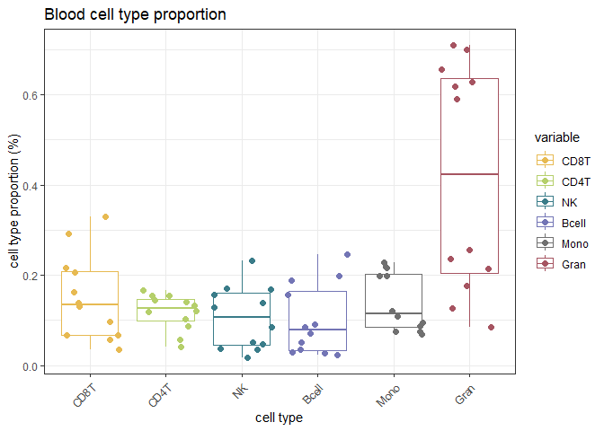

<!-- README.md is generated from README.Rmd. Please edit that file -->

# CellsPickMe

<!-- badges: start -->

[](https://doi.org/10.5281/zenodo.15225880)

<!-- badges: end -->


The **CellsPickMe** package takes DNA methylation (DNAme) data generated
from Illumina microarray of a heterogeneous tissue and predict its
cellular composition based on cell types available in the reference
profiles. *Notably, for each population of **cells**, the package
“**picks**” DNA**me** features that best predict cellular identities
with machine learning algorithms to improve deconvolution performance.*
Currently, the algorithm is compatible for peripheral blood, cord blood,
saliva, and brain (neuron vs non-neuron).

## Installation

You can install the development version of CellsPickMe from
[GitHub](https://github.com/) with:

``` r
# install.packages("devtools")
library(devtools)
devtools::install_github("maggie-fu/CellsPickMe")
```

## Usage

Reference-based cell type deconvolution includes four steps: reference
dataset selection, data normalization, feature selection, and cell
composition regression.

### 1. Obtain reference dataset

From the available list of reference datasets (“Reinius”, “IDOL”,
“Extended”, “UniBlood7”, “UniBlood13”, “UniBlood19”, “Cord”, “DLPFC”,
and “Middleton”), select one that is appropriate for your sample (based
on tissue and sample age) For more detail regarding the references,
check out the
[vignette](https://maggie-fu.github.io/CellsPickMe/articles/CellsPickMe.html)
and [UniBlood Reference
Generation](https://maggie-fu.github.io/CellsPickMe/articles/UniBlood_references.html)
page

``` r
library(CellsPickMe)

# Request the IDOL reference (2016) with no normalization
ref_dat <- getRef(ref = "UniBlood19", normType = "None")
```

### 2. Normalize sample and reference datasets together

Normalize user’s sample and reference data sets together to reduce batch
effect and improve prediction accuracy. Option for `normType` includes
“Noob”, “Funnorm”, “Quantile”, “Quantile.b”, “None”, with the first 3
options being exclusively for RGChannelSet objects, and Quantile.b for
beta matrix.

``` r
# Load example blood cell mixture, subsetted from the IDOL dataset (GSE110554)
test_dat <- CellsPickMe::IDOL_mixed_cells
    
# Combine sample and reference data sets together, followed by normalization (if selected)
comb_dat <- combData(dataset = test_dat, 
                     reference = ref_dat$reference,
                     cellTypes = ref_dat$cellTypes, 
                     class = "rgset",               #c("rgset", "betas")
                     normType = "Quantile")         # c("Noob", "Funnorm", "Quantile", "Quantile.b", "None")
#> Combining Data with Flow Sorted Data and Normalizing.
```

### 3. Pick features that best distinguish cell type

The **CellsPickMe** package supports feature selection with either the
traditional T-test, or with machine-learning-based methods such as
elastic net and random forest to obtain a curated list of features that
are highly predictive of cell types

Here is the T-test based feature selection method.

``` r
# Pick probes with T tests
probes <- pickProbes(dataNormed = comb_dat, 
                     probeList = "Ttest", #c("Ttest", "IDOL")
                     probeSelect = "both", #c("both", "any", "pval")
                     nProbes = 100, # number of probes to pick for each cell type
                     p.val = 0.05,  # max pval
                     min.delta.beta = 0.05, # min delta beta
                     plotRef = T, # plot heatmap?
                     verbose = T)
#> Estimating Weights for Cell Type Prediction Based on Selected Probeset.
```


Alternatively, here are some options for machine-learning-based feature
selection.

``` r
### Set up server for parallelization - run the code if picking probes with Caret
library(doParallel)
cl <- makeCluster(detectCores() - 1) # change as needed
registerDoParallel(cl)

# Pick probes with repeated cross validation with lasso and elastic net (EN)
probes <- pickProbes(dataNormed = comb_dat, 
                     probeList = "Caret_CV", #c("Caret_CV", "Caret_LOOCV")
                     caretMods = c("RF", "EN"),  #c("lasso", "EN", "BLR", "CART", "RF", "GBM", "PLDA", "GAnRF", "GAnNB", "GAnSVM", "GAnNN")
                     probeSelect = "any",
                     p.val = 1, 
                     min.delta.beta = 0,
                     filterK = 1000, # number of probes to put into the predictor for each cell type
                     seed = 1, 
                     plotRef = F, # plot heatmap?
                     verbose = F)

# Picked probes with RF and the estimated coefficients
head(probes$coefs$probeCoefs$RF)
#>            Bcell_cord      Bmem       Bnv CD8T_cord    CD8mem     CD8nv
#> cg24262870  0.1235089 0.7885589 0.1454030 0.7988769 0.9002228 0.8815243
#> cg24667756  0.1468955 0.3246588 0.1774464 0.8213872 0.8656461 0.8369870
#> cg21531416  0.1954677 0.7161480 0.2611708 0.6352860 0.9123706 0.8243531
#> cg27436324  0.2643973 0.7655840 0.2042478 0.8774527 0.9099452 0.8940336
#> cg18406792  0.1745236 0.4272825 0.1660204 0.8060743 0.8471631 0.8077735
#> cg15198193  0.1576836 0.7751659 0.4488992 0.6089112 0.8850735 0.6163415
#>            CD4T_cord    CD4mem     CD4nv      Treg Gran_cord       Bas
#> cg24262870 0.6986202 0.8848730 0.8628457 0.8774487 0.8433450 0.8428693
#> cg24667756 0.8015645 0.8815034 0.8414196 0.8673486 0.8545976 0.8684859
#> cg21531416 0.8386425 0.9126800 0.8887243 0.9108057 0.7946011 0.8733178
#> cg27436324 0.8877283 0.9060499 0.8918332 0.9088491 0.9053751 0.9017803
#> cg18406792 0.8015001 0.8518648 0.8016774 0.8430231 0.8296527 0.8415291
#> cg15198193 0.4571046 0.8280606 0.4386012 0.8255160 0.8851114 0.8909355
#>                  Eos       Neu Mono_cord      Mono   NK_cord        NK
#> cg24262870 0.8384348 0.8475652 0.8450575 0.8577191 0.8034451 0.8599368
#> cg24667756 0.8734111 0.8663822 0.8567890 0.8722139 0.7773920 0.8388949
#> cg21531416 0.8870945 0.8667716 0.7915671 0.8902495 0.8265656 0.8828000
#> cg27436324 0.9044173 0.9059902 0.9076917 0.9014642 0.8858523 0.8931943
#> cg18406792 0.8097433 0.8522817 0.8409429 0.8522421 0.7989837 0.8274087
#> cg15198193 0.8939239 0.9035070 0.8632832 0.8930117 0.7029587 0.7756338
#>                 nRBC
#> cg24262870 0.7149653
#> cg24667756 0.8298977
#> cg21531416 0.8788950
#> cg27436324 0.9048735
#> cg18406792 0.7034571
#> cg15198193 0.8892714
```

#### Assess clustering stability

To further evaluate the performance of the selected probes, pvClust can
be applied to assess whether the picked probes can be used to generate
the correct cluster (cell type labeling) in reference data

``` r
clustAU <- identClust(dataNormed = comb_dat,
                      probes = probes,
                      parallel = TRUE)
#> Creating a temporary cluster...done:
#> socket cluster with 15 nodes on host 'localhost'
#> Multiscale bootstrap... Done.
#> Creating a temporary cluster...done:
#> socket cluster with 15 nodes on host 'localhost'
#> Multiscale bootstrap... Done.
```

### 4. Estimate cell type proportion

Finally, the selected features are used to estimate cell type
proportions in the sample data set. We also incorporate the CETYGO score
(see Reference) to estimate prediction performance even in the absence
of a validation cohort / ground truth cell count.

``` r
out <- predictCT(dataNormed = comb_dat, 
                 probes = probes, 
                 method = "CP",  #c("CP", "RPC", "SVR")
                 removenRBC = F, # remove nRBC?
                 verbose = F, 
                 cetygo = T) # CETYGO to assess reference appropriateness (RMSE evaluation)
```

### Examine output

``` r
# Estimated proportions based on UniBlood19 reference, Quantile normalization, RF feature selection, and constraint projection
# CETYOGO score column shows the CETYGO score for each sample
head(out$RF)
#>                        Bcell_cord        Bmem          Bnv     CD8T_cord
#> 201868590193_R01C01  4.900574e-03 0.033452481 1.379462e-01  1.514549e-17
#> 201868590243_R02C01  3.651905e-18 0.003854140 2.263836e-02  1.437579e-17
#> 201868590267_R01C01  8.517287e-19 0.001492958 7.777743e-03  9.612166e-18
#> 201868590267_R05C01 -4.750408e-19 0.000000000 8.474686e-19 -5.644007e-18
#> 201869680008_R01C01 -8.604787e-18 0.016948846 4.167371e-02 -2.885869e-18
#> 201869680008_R03C01  4.207191e-18 0.001690919 1.916507e-04  1.366324e-17
#>                         CD8mem      CD8nv   CD4T_cord     CD4mem        CD4nv
#> 201868590193_R01C01 0.09173997 0.10524220 0.003926924 0.03872764 0.0000000000
#> 201868590243_R02C01 0.01850916 0.05208359 0.029338138 0.07047455 0.0200054165
#> 201868590267_R01C01 0.02684480 0.05160417 0.016167004 0.05741796 0.0005965834
#> 201868590267_R05C01 0.04888686 0.09128600 0.031025712 0.09102361 0.0067783757
#> 201869680008_R01C01 0.12561960 0.16432521 0.033519080 0.08303561 0.0020908658
#> 201869680008_R03C01 0.03353352 0.07468721 0.021948900 0.07435698 0.0093463515
#>                            Treg     Gran_cord           Bas           Eos
#> 201868590193_R01C01 0.001226282 -9.632261e-18  1.724723e-18 -3.909634e-18
#> 201868590243_R02C01 0.019797856 -2.398769e-17  1.834631e-18  0.000000e+00
#> 201868590267_R01C01 0.008459640 -1.141656e-17 -2.596394e-18  1.631795e-18
#> 201868590267_R05C01 0.014504984 -3.927637e-17  1.718343e-18  1.459127e-19
#> 201869680008_R01C01 0.015657041 -3.078488e-17 -7.265285e-19  0.000000e+00
#> 201869680008_R03C01 0.015005326 -1.206880e-17  2.004191e-18  0.000000e+00
#>                           Neu     Mono_cord       Mono       NK_cord
#> 201868590193_R01C01 0.2342231  2.738654e-19 0.20168628 -1.682621e-17
#> 201868590243_R02C01 0.7117166  5.758737e-18 0.04418971 -1.019774e-17
#> 201868590267_R01C01 0.7336139 -2.737916e-18 0.09906315 -1.600910e-18
#> 201868590267_R05C01 0.6399841 -1.116955e-18 0.06725238  2.389558e-17
#> 201869680008_R01C01 0.1218932  1.143990e-18 0.24001386 -8.338604e-18
#> 201869680008_R03C01 0.6862866  7.171603e-18 0.05876430 -1.070111e-17
#>                               NK          nRBC     CETYGO
#> 201868590193_R01C01 1.498043e-01  4.923736e-19 0.03460435
#> 201868590243_R02C01 8.779442e-03 -7.450351e-19 0.03319760
#> 201868590267_R01C01 2.421607e-18  8.673617e-19 0.03196155
#> 201868590267_R05C01 1.026174e-02 -1.487835e-18 0.03414952
#> 201869680008_R01C01 1.568069e-01 -1.228120e-18 0.03585871
#> 201869680008_R03C01 2.326621e-02 -8.343516e-19 0.03310038

# Basic visualization of deconvolution output
library(ggplot2)
library(dplyr)
library(reshape2)

plt <- out$RF[, ref_dat$cellTypes] %>%
    as.data.frame(.) %>% 
    reshape2::melt()
ggplot(plt, aes(variable, value, color = variable)) + 
    geom_boxplot() + 
    geom_point(size = 2, position = position_jitter()) + 
    theme_bw() + 
    labs(x = "cell type", 
         y = "cell type proportion (%)", 
         title = "Blood cell type proportion") +
    scale_color_manual(values = c(Bcell_cord = "#9C9EDEFF", 
                                  Bnv = "#7375B5FF", 
                                  Bmem = "#4A5584FF", 
                                  Bcell = "#7375B5FF",
                                  CD4T_cord = "#CEDB9CFF", 
                                  CD4nv = "#B5CF6BFF", 
                                  CD4mem = "#637939FF", 
                                  Treg = "#8CA252FF", 
                                  CD4T = "#B5CF6BFF",
                                  CD8T_cord = "#E7CB94FF", 
                                  CD8nv = "#E7BA52FF", 
                                  CD8mem = "#8C6D31FF", 
                                  CD8T = "#E7BA52FF",
                                  NK_cord = "#7BBCB0FF", 
                                  NK = "#3A7C89FF", 
                                  Mono_cord = "#F3CBD3FF", 
                                  Mono = "#707070",
                                  Gran_cord = "#D39C83FF", 
                                  Gran = "#A65461FF", 
                                  Neu = "#A65461FF", 
                                  Bas = "#7B4173FF",
                                  Eos = "#A55194FF", 
                                  nRBC = "#843C39FF")) +
    theme(axis.text.x = element_text(angle = 45, vjust = 0.9, hjust = 1))
```



## Citation

The manuscript detailing CellsPickMe and its use is currently under
preparation. For more information about this please contact Maggie Fu at
<maggie.fu@bcchr.ca>.

## References

Depending on the options you used, please consider citing the following
references as this package is built on their data / code / papers.

1.  DS Vellame et al. (2023). Uncertainty quantification of
    reference-based cellular deconvolution algorithms. *Epigenetics* 18,
    1: 2137659. doi:
    [10.1080/15592294.2022.2137659](https://doi.org/10.1080/15592294.2022.2137659)

    - Please cite this paper if you set the parameter `cetygo = T` for
      `predictCT()`

2.  LE Reinius et al. (2012). Differential DNA methylation in purified
    human blood cells: implications for cell lineage and studies on
    disease susceptibility. *PloS one*. *7*(7), e41361. doi:
    [10.1371/journal.pone.0041361](https://doi.org/10.1371/journal.pone.0041361)

    - Please cite this paper if you used this reference dataset,
      i.e. `getRef(ref = "Reinius")`

3.  DC Koestler et al. (2016). Improving cell mixture deconvolution by
    identifying optimal DNA methylation libraries (IDOL). *BMC
    bioinformatics*. 17, 120. doi:
    [10.1186/s12859-016-0943-7](https://doi.org/10.1186/s12859-016-0943-7)

    - Please cite this paper if you used this reference dataset,
      i.e. `getRef(ref = "IDOL")`

4.  LA Salas et al. (2022) Enhanced cell deconvolution of peripheral
    blood using DNA methylation for high-resolution immune profiling.
    *Nat Commun*. 13, 761. doi:
    [10.1038/s41467-021-27864-7](https://doi.org/10.1038/s41467-021-27864-7)

    - Please cite this paper if you used this reference dataset,
      i.e. `getRef(ref = "Extended")`

5.  K Gervin et al. (2019). Systematic evaluation and validation of
    reference and library selection methods for deconvolution of cord
    blood DNA methylation data. *Clinical epigenetics*. 11, 1-15. doi:
    [10.1186/s13148-019-0717-y](https://doi.org/10.1186/s13148-019-0717-y)

    - Please cite this paper if you used this reference dataset,
      i.e. `getRef(ref = "Cord")`

6.  LY Middleton et al. (2022). Saliva cell type DNA methylation
    reference panel for epidemiological studies in children.
    *Epigenetics*, *17*(2), 161-177. doi:
    [10.1371/journal.pone.0041361](https://doi.org/10.1371/journal.pone.0041361)

    - Please cite this paper if you used this reference dataset,
      i.e. `getRef(ref = "Middleton")`

7.  J Guintivano et al. (2013). A cell epigenotype specific model for
    the correction of brain cellular heterogeneity bias and its
    application to age, brain region and major depression.
    *Epigenetics*, *8*(3), 290-302. doi:
    [10.4161/epi.23924](https://doi.org/10.4161/epi.23924)

    - Please cite this paper if you used this reference dataset,
      i.e. `getRef(ref = "DLPFC")`

8.  TJ Triche, et al. (2013). Low-level processing of Illumina Infinium
    DNA Methylation BeadArrays. *Nucleic Acids Res*. 41, e90. doi:
    [10.1093/nar/gkt090](http://www.dx.doi.org/10.1093/nar/gkt090).

    - Please cite this paper if you used this normalization method,
      i.e. `getRef(normType = "Noob")` or `combData(normType = "Noob")`

9.  JP Fortin et al. (2014). Functional normalization of 450k
    methylation array data improves replication in large cancer studies.
    *Genome Biology* 15, 503. doi:
    [10.1186/s13059-014-0503-2](http://www.dx.doi.org/10.1186/s13059-014-0503-2).

    - Please cite this paper if you used this normalization method,
      i.e. `getRef(normType = "Funnorm")` or
      `combData(normType = "Funnorm")`

10. N Touleimat and J Tost. (2012). *Complete pipeline for Infinium
    Human Methylation 450K BeadChip data processing using subset
    quantile normalization for accurate DNA methylation estimation.*
    *Epigenomics* 4, 325-341. doi:
    [10.2217/epi.12.21](https://doi.org/10.2217/epi.12.21)

    - Please cite this paper if you used this normalization method,
      i.e. `getRef(normType = "Quantile")` or
      `combData(normType = "Quantile")`
